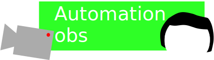

# 

**Automation-OBS** é um aplicativo leve e prático feito para gravações estilo VTuber, com animações simples e controle via teclado, mouse ou ponteiro virtual.

## 🚀 Recursos principais

- Controle facial (3 expressões)
- Efeito de zoom com um toque
- Mãos animadas com teclas A/D
- Controle por mouse ou manual (X/Y)
- Editor de aparência: cabelo e camisa
- Botão para ocultar/exibir o menu

## 🖥️ Instalação

### Windows
1. Baixe o zip: [Download para Windows](https://github.com/matheussouzadejesus10/automation-obs/releases/tag/app) <!-- substitua pelo link real -->
2. Extraia (se zipado) e execute o `.exe`.

### Web (MacOS/Linux)
Acesse a versão web: [Abrir no navegador](https://automation-obs-web.netlify.app/) <!-- substitua pelo link real -->

## 💾 Baixar versão offline

Você pode baixar a versão offline do app em HTML:

🔗 **[Clique aqui para baixar a versao offline](https://github.com/matheussouzadejesus10/automation-obs/raw/main/Automation-obs-offline.html
)**  
Basta abrir o arquivo no seu navegador, sem precisar de internet!

## 🎮 Controles

| Tecla | Função |
|-------|--------|
| `1`, `2`, `3` | Troca de expressões do personagem |
| `Espaço` | Zoom (efeito de aproximação) |
| `A` e `D` | Ativa as mãos |
| **Botão 1 ou a tecla"5"** | Alterna entre controle por mouse ou coordenadas |
| **Botão 2** | Abre o editor de aparência |
| **Botão 3** | Esconde ou mostra o menu |

## 🧪 Exemplo visual

### Controle de movimento

### Editor de Aparência

### Alternar menu

## 🛠️ Requisitos

- Sistema: Windows 10+ ou navegador moderno (WebGL)
- Processador: 1.5GHz+
- Memória RAM: 2GB ou mais

## 📩 Contribuição

Quer ajudar? Sinta-se à vontade para abrir uma *issue* ou *pull request*!  
Feito por [@matheus8910](https://github.com/matheussouzadejesus10) com ❤️

## Notas e Créditos

### criado por:[matheus souza 10 studios](https://scratch.mit.edu/users/matheussouza19/)
### base do jogo:
### jogo original:Automation Meme Template
### de:[360Genius](https://scratch.mit.edu/users/360Genius/)
---
